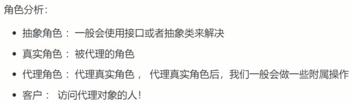
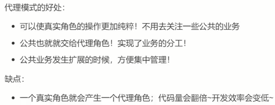
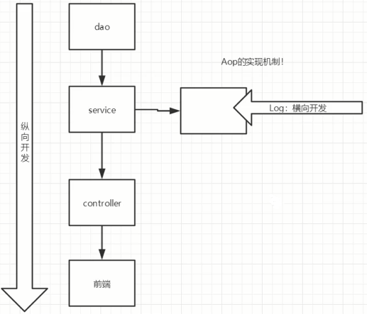
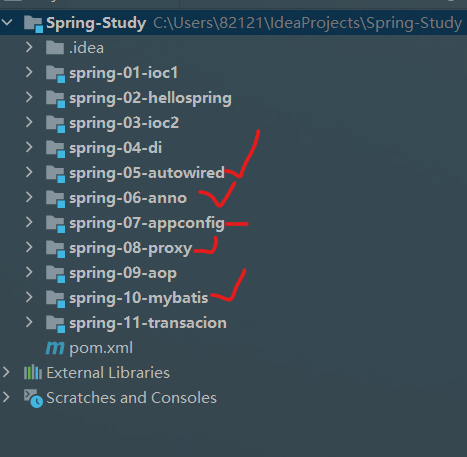

* Java 中 IO 流分为⼏种? 

按照流的流向分，可以分为输⼊流和输出流； 
按照操作单元划分，可以划分为字节流和字符流；
按照流的⻆⾊划分为节点流和处理流。

InputStream/Reader: 所有的输⼊流的基类，前者是字节输⼊流，后者是字符输⼊流。 OutputStream/Writer: 所有输出流的基类，前者是字节输出流，后者是字符输出流。

（1）节点流：可以从或向一个特定的地方（节点）读写数据。如FileReader。
（2）处理流（用来包装节点流）：是对一个已存在的流的连接和封装，通过所封装的流的功能调用实现数据读写。如BufferedReader。处理流的构造方法总是要带一个其他的流对象做参数。一个流对象经过其他流的多次包装，称为流的链接。


java8中，取消永久代，方法存放于元空间(Metaspace)，元空间仍然与堆不相连，但与堆共享物理内存，逻辑上可认为在堆中


### 静态代理





静态代理缺点，代码量翻倍，几十个真实角色就得写几十个代理

### 动态代理

```java
动态代理个人的理解：
这里更像new了一个“代理器”，声明了有代理这回事（告诉Java，我需要代理，实现用户的新需求！），
至于代理谁，谁代理，代理的什么事，是下面三步要做的事，
建议结合着反射的思想来理解，甚至有必要画图来表示一下反射的机制，
实际业务生产中，不方便改底层代码来改需求，所以需要借助“代理”，
这个代理其实就是一个反射，动态代理并不需要new不同的代理人物，而是通过代理类Proxy来实现，
我更愿意称这个代理类Proxy为一个“代理器”，是java为了方便我们而创建的动态代理。
```

AOP横向开发 [B站狂神说Spring5第18集](https://www.bilibili.com/video/BV1WE411d7Dv?p=2)

反射思想在这里的体现就是controller反射到service层，进行业务的横向开发




Spring简单User项目创建步骤

1. 导入pom文件的依赖
2. 建包com.kuang，pojo实体类包下：实体类User
3. mapper包下：接口UserMapper
4. 导入MyBatis配置：resources下的核心配置文件mybatis-config.xml
5. 整合MyBatis：resources下的spring-dao.xml
   1. 配置数据源DataSource
   2. sqlSessionFactory
   3. sqlSession/SqlSessionTemplate
6. 绑定数据库语句接口：UserMapper.xml，在Mapper包下与接口UserMapper同文件名
7. 接口实现类：Mapper包下UserMapperImpl
8. Spring配置文件，将实现类UserMapperImpl注入到Spring里面：resources下的applicationContext.xml
9. Test测试类：MyTest

增加User项目功能的步骤：

1. 增加接口的功能
2. 增加数据库语句
3. 增加接口的实现类功能


掌握5、6，练习7，8是代理，主要内容是反射，迟早要掌握，在SpringBoot中，10掌握

